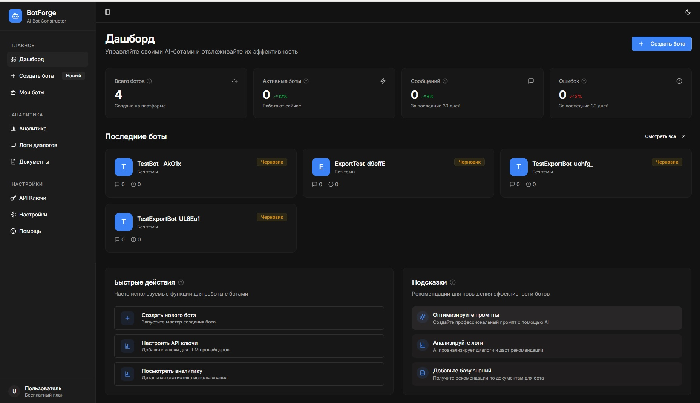
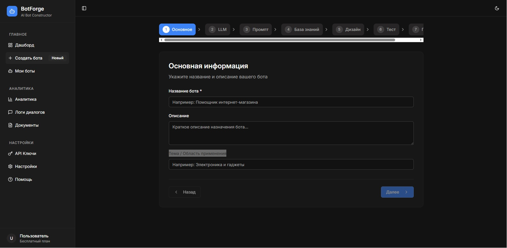
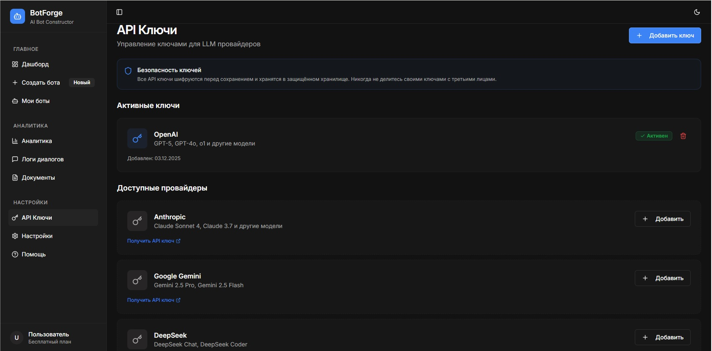
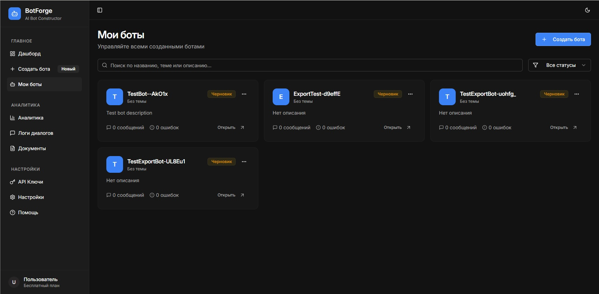
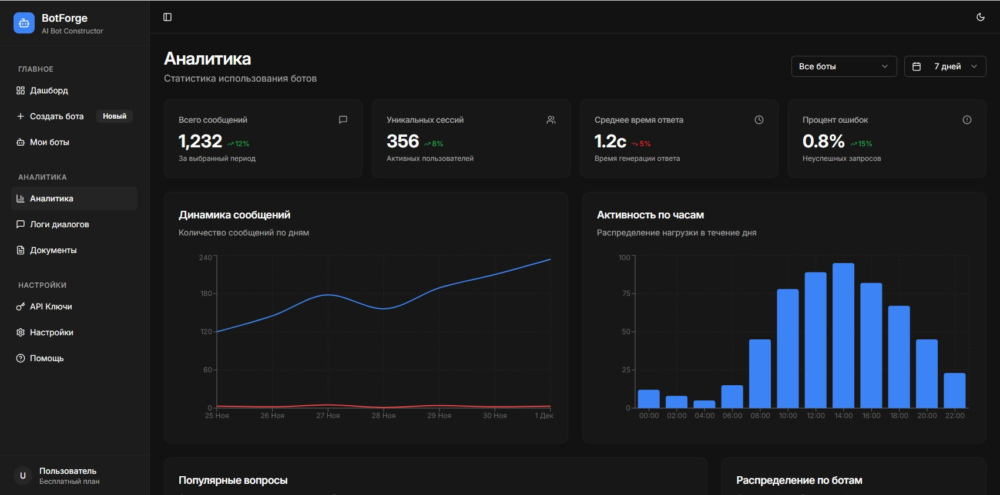

# BotForge

## О проекте

BotForge — showcase-проект конструктора AI-ботов-консультантов с поддержкой базы знаний и мультипровайдерных LLM.

Идея проекта: пользователь может без кода создать бота, загрузить документы, подключить базу знаний, протестировать ответы и подготовить бота для сайта или Telegram.

## Какую задачу решает

Проект решает задачу быстрого запуска бизнес-ассистентов для консультаций, продаж и поддержки без разработки отдельного AI-решения с нуля под каждый сценарий.

## Что сделано лично мной

- проектирование логики продукта
- проектирование backend-архитектуры
- логика работы AI-ботов поверх базы знаний
- интеграция нескольких LLM-провайдеров
- проектирование flow загрузки документов и retrieval
- сценарии тестирования ответов бота
- логирование и аналитика взаимодействий

## Ключевые функции

- создание AI-ботов без кода
- загрузка и обработка документов
- база знаний для бота
- ответы по контексту через retrieval
- поддержка нескольких LLM-провайдеров
- тестирование ответов
- подготовка Telegram-версии или встраивания на сайт
- логи и аналитика

## Стек

- React + TypeScript
- Node.js / Express
- PostgreSQL
- Drizzle ORM
- FAISS
- OpenAI
- Anthropic
- Google Gemini
- DeepSeek
- GigaChat
- PDF processing

## Архитектура

Основные слои системы:

1. Web-интерфейс для настройки бота
2. Backend API
3. Хранилище проектов, пользователей и настроек
4. Модуль загрузки и обработки документов
5. Knowledge base / retrieval
6. Слой подключения LLM-провайдеров
7. Логи, тестирование и аналитика

## Как работает основной сценарий

1. Пользователь создает нового AI-бота.
2. Загружает документы или материалы для базы знаний.
3. Система обрабатывает документы и готовит данные для поиска.
4. Бот получает вопрос пользователя.
5. Retrieval-слой подбирает релевантный контекст.
6. LLM формирует ответ с учетом базы знаний.
7. Ответ можно протестировать, посмотреть в логах и улучшить настройки.

## Скриншоты

## Статус проекта

Репозиторий опубликован в showcase-формате.

Цель репозитория — показать архитектуру, ключевые сценарии и мою роль в разработке. Часть приватной инфраструктурной логики, ключи, реальные данные и внутренние интеграции не публикуются.

## Дополнительно

При необходимости могу отдельно показать:

- архитектурную схему
- backend-процесс
- примеры экранов
- описание RAG и логики базы знаний
- детали подключения LLM-провайдеров