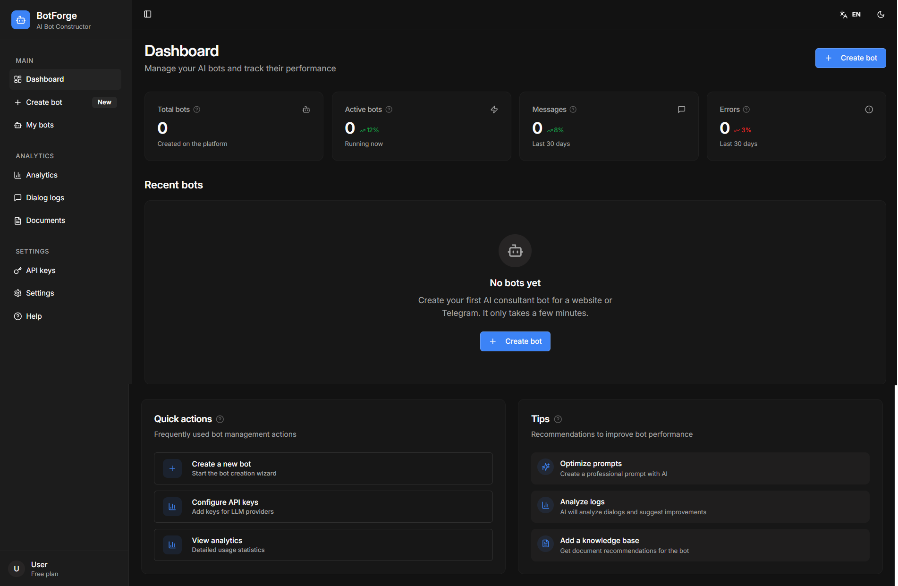
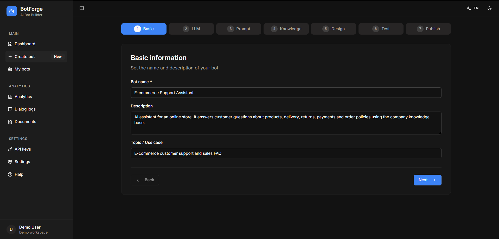
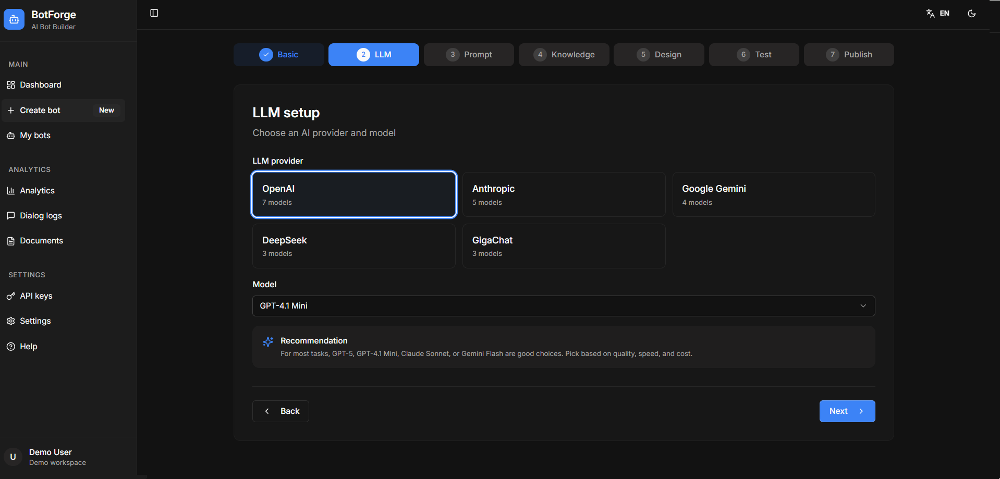
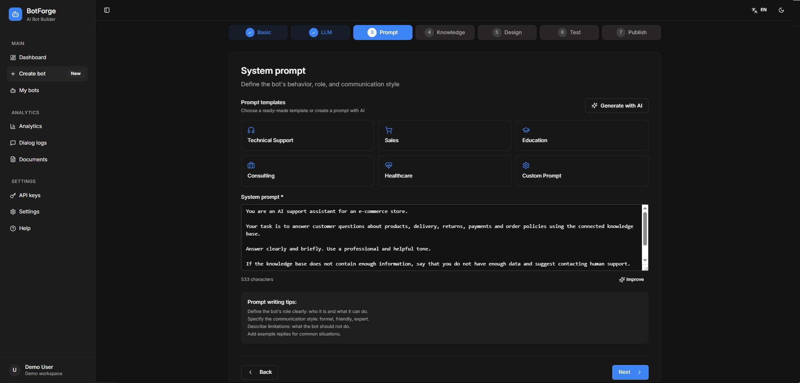
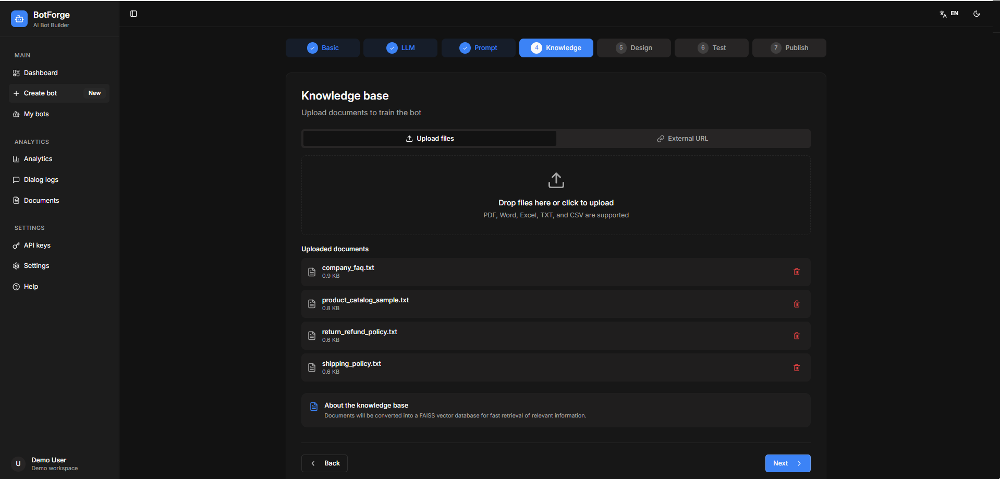
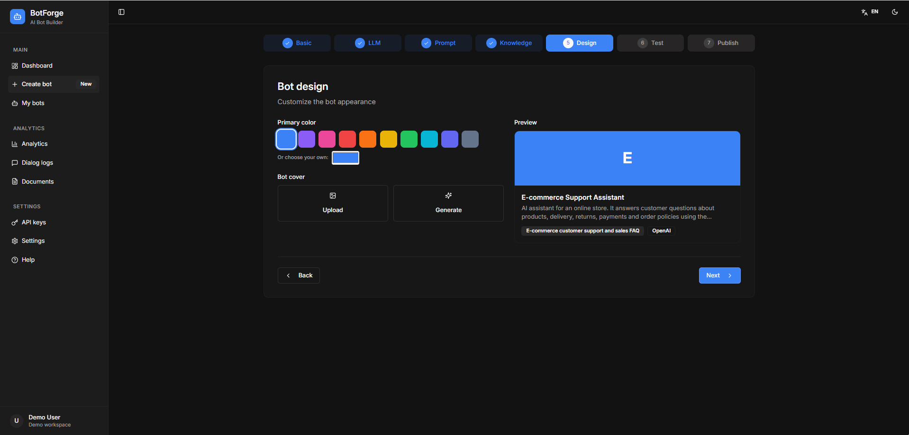
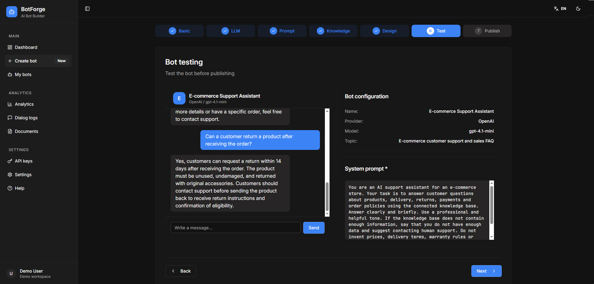
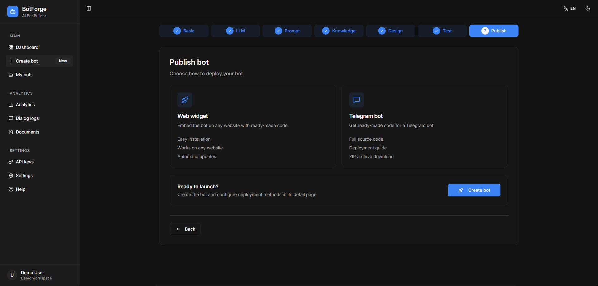

# BotForge - AI Bot Builder Showcase

BotForge is a showcase repository for an AI bot builder designed to create business AI assistants with knowledge base support, retrieval flow and multi-provider LLM integration.

The product idea is simple: a user can create an AI assistant, configure its behavior, upload business documents, connect a knowledge base, test responses and prepare the bot for use as a website widget or Telegram bot.

## Repository Status

This repository is published as a portfolio showcase / case study.

The full production source code is not public.

This repository is intended to present:

* product concept
* user workflow
* AI bot builder logic
* knowledge base and retrieval flow
* multi-provider LLM integration approach
* screenshots of the working interface
* architecture and implementation decisions
* safe public presentation of a private AI product

The original implementation contains private logic, API integrations, environment configuration, internal workflows and sensitive data that are not suitable for public release.

This repository does not include:

* full production source code
* API keys or `.env` files
* real user data
* private prompts
* production databases
* internal business workflows
* sensitive logs
* private infrastructure details

## Problem

Many small and medium businesses want to use AI assistants for customer support, sales, onboarding, internal documentation and knowledge access.

However, building a separate AI assistant from scratch for every business use case is slow and expensive. A typical solution requires document processing, prompt configuration, retrieval logic, LLM integration, testing, logging and deployment preparation.

BotForge addresses this problem by providing a structured workflow for creating configurable AI assistants that can answer questions using uploaded documents and business-specific knowledge.

## Solution

BotForge is designed as a product-style AI bot builder.

The main workflow:

1. Create a new AI assistant.
2. Configure bot behavior and business context.
3. Select an LLM provider and model.
4. Write or generate a system prompt.
5. Upload documents for the knowledge base.
6. Process documents for retrieval.
7. Test bot responses.
8. Review configuration and behavior.
9. Prepare the bot for website or Telegram deployment.

The key focus is not only LLM integration. The project demonstrates the complete product flow around an AI assistant: bot configuration, knowledge base handling, retrieval logic, prompt setup, testing, design preview and publishing options.

## My Role

My work on this project focused on:

* product workflow design
* AI assistant creation flow
* backend architecture planning
* knowledge base and retrieval flow
* multi-provider LLM integration concept
* document upload and processing workflow
* system prompt configuration flow
* response testing scenarios
* logging and analytics concepts
* portfolio-safe showcase structure

## Key Features

* AI assistant creation workflow
* bot behavior configuration
* system prompt setup
* knowledge base support
* document upload and processing
* retrieval-based answer generation
* multi-provider LLM setup
* response testing interface
* bot design preview
* publishing options for web widget and Telegram bot
* logs and analytics concept
* product-style management dashboard

## Tech Stack and Architecture

The original project architecture is based on a web application with backend logic, database storage, file-processing workflow and LLM provider integrations.

Main technologies and concepts used in the project:

* React
* TypeScript
* Node.js
* Express
* PostgreSQL
* Drizzle ORM
* FAISS / vector search concept
* OpenAI API
* Anthropic Claude API
* Google Gemini API
* DeepSeek API
* GigaChat API
* document processing
* knowledge base workflow
* retrieval-based AI responses
* prompt engineering
* API integration
* bot deployment workflow

## Architecture Overview

The system is designed around several core layers.

### 1. Web Interface

The web interface is used to create bots, manage settings, upload documents, configure prompts, test responses and prepare deployment options.

### 2. Backend API

The backend handles bot configuration, project data, knowledge base operations, LLM provider connections and application logic.

### 3. Database Layer

The database stores projects, bots, user settings, metadata, logs and configuration data.

### 4. Document Processing Layer

The document-processing layer handles uploaded files, extracts text and prepares content for knowledge base search.

### 5. Knowledge Base / Retrieval Layer

The retrieval layer selects relevant context from processed documents and passes it to the LLM layer for grounded responses.

### 6. LLM Provider Layer

The LLM provider layer provides a unified integration point for multiple model providers.

### 7. Testing and Observability Layer

The testing, logs and analytics layer helps review bot behavior, inspect responses and monitor usage patterns.

## Main User Flow

1. The user creates a new AI bot.
2. The user defines the business use case and assistant description.
3. The user selects an LLM provider and model.
4. The user configures the system prompt.
5. The user uploads business documents.
6. The system prepares documents for knowledge base search.
7. The user tests the assistant with realistic questions.
8. The assistant generates answers based on bot settings and available knowledge.
9. The user reviews the result and prepares the bot for publishing.

## Screenshots

### Dashboard

Main BotForge dashboard for managing AI assistants, projects and product workflow.

---

### Create and Configure AI Assistant

Bot setup flow with business context, use case and assistant description.

---

### Multi-Provider LLM Setup

Unified LLM provider selection with support for OpenAI, Anthropic, Google Gemini, DeepSeek and other model providers.

---

### System Prompt Configuration

Assistant behavior, role, response rules and safety constraints configured through a structured system prompt.

---

### Knowledge Base and Document Processing

Uploaded business documents are prepared for retrieval-based answers and converted into a searchable knowledge base.

---

### Bot Design Preview

Visual bot configuration with preview card, color settings and generated assistant metadata.

---

### Bot Testing

Testing screen showing how the assistant responds to customer questions using the configured bot profile and knowledge base.

---

### Publishing Options

Deployment options for using the assistant as a web widget or Telegram bot.

## What This Project Demonstrates

This project demonstrates applied AI product architecture, not just isolated API calls.

It shows experience with:

* designing AI assistant workflows
* structuring RAG-style knowledge base logic
* planning backend architecture for AI products
* working with document-based AI flows
* designing multi-provider LLM integration
* configuring system prompts and assistant behavior
* building product-style bot management workflows
* thinking through testing, deployment and observability
* presenting private AI projects safely as public portfolio case studies

## Privacy and Security Notes

This repository is intentionally limited to safe public materials.

The following materials are not published:

* production source code
* API keys
* `.env` files
* private prompts
* real user data
* customer documents
* production databases
* internal logs
* private deployment configuration
* sensitive business logic

This approach keeps the showcase useful for portfolio review while protecting private implementation details.

## Related Skills

AI assistants, LLM integration, RAG systems, knowledge bases, vector search, document processing, prompt engineering, API integrations, backend architecture, product logic, Telegram bot deployment workflow, logs and analytics, AI product prototyping.

## Additional Information

Additional technical details, architecture notes or implementation explanations can be provided separately when relevant.
